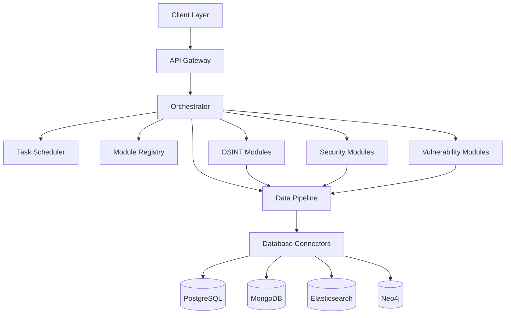

<div align="center">
  
</div>

# SKrulll

### Advanced Cybersecurity and OSINT Tool Orchestrator

[](https://opensource.org/licenses/MIT)
[](https://www.python.org/downloads/)
[](https://www.docker.com/)
[](CONTRIBUTING.md)

*Unify, Orchestrate, Secure*

## 📋 Table of Contents

- [Overview](#-overview)
- [Key Features](#-key-features)
- [System Architecture](#-system-architecture)
- [Components](#-components)
- [Installation](#-installation)
  - [Prerequisites](#prerequisites)
  - [Standard Installation](#standard-installation)
  - [Docker Installation](#docker-installation)
- [Configuration](#-configuration)
- [Usage Guide](#-usage-guide)
  - [Command Line Interface](#command-line-interface)
  - [Web Interface](#web-interface)
  - [API Integration](#api-integration)
- [Development](#-development)
  - [Project Structure](#project-structure)
  - [Adding New Modules](#adding-new-modules)
  - [Testing](#testing)
- [Troubleshooting](#-troubleshooting)
- [Contributing](#-contributing)
- [License](#-license)

## 🔍 Overview

**SKrulll** is a comprehensive cybersecurity and OSINT (Open Source Intelligence) tool orchestrator that provides a unified interface for various security tools. It enables seamless integration between different security components with centralized configuration and data sharing capabilities.

SKrulll bridges the gap between disparate security tools, creating a cohesive ecosystem where data flows efficiently between reconnaissance, scanning, analysis, and reporting phases. This integration dramatically improves security assessment workflows and provides deeper insights through cross-tool data correlation.

## 🚀 Key Features

- **🧩 Modular Architecture**: Easily extend functionality with new tools and capabilities
- **🖥️ Unified Interface**: Access all tools through a consistent CLI and intuitive web dashboard
- **⚙️ Automated Workflows**: Chain tools together for comprehensive security assessments
- **📊 Advanced Reporting**: Generate consolidated findings from multiple tools with customizable templates
- **🗄️ Multi-Database Support**: Store and query data using PostgreSQL, MongoDB, Elasticsearch, and Neo4j
- **📈 Interactive Visualization**: Generate dynamic visual representations of network maps, attack paths, and data relationships
- **⏱️ Intelligent Scheduling**: Automate recurring tasks with dependency awareness and priority handling
- **🔄 Real-time Monitoring**: Track ongoing scans and receive alerts on critical findings
- **🔌 API Integration**: Connect with external systems through a comprehensive REST API
- **🔒 Role-based Access Control**: Secure multi-user environment with granular permissions

## 🏗️ System Architecture

SKrulll follows a microservices architecture with containerized components that can scale independently:



This architecture ensures:
- **Scalability**: Components can be scaled independently based on workload
- **Resilience**: Failure in one module doesn't affect the entire system
- **Flexibility**: New modules can be added without disrupting existing functionality
- **Performance**: Resource-intensive tasks can be distributed across multiple nodes

## 🧰 Components

SKrulll consists of several key components working together:

| Component | Description | Technologies |
|-----------|-------------|--------------|
| **OSINT Modules** | Domain reconnaissance, social media analysis, search footprinting | Python, Go |
| **Security Modules** | Vulnerability scanning, port scanning, network mapping, attack vector analysis | Python, Rust |
| **Orchestrator** | Core system that manages tool execution and data flow | Python |
| **Web Interface** | User-friendly dashboard for managing scans and viewing results | Flask, React |
| **CLI** | Command-line interface for scripting and automation | Python, Click |
| **Scheduler** | Task scheduling and management with dependencies | Python, Celery |
| **Database Connectors** | Interfaces to various databases for data storage and retrieval | SQLAlchemy, PyMongo, Elasticsearch-DSL, Neo4j-Python |

## 📥 Installation

### Prerequisites

- Python 3.8+
- Docker and Docker Compose (for containerized components)
- Neo4j (for attack path mapping)
- PostgreSQL (for primary data storage)
- MongoDB (for unstructured data storage)
- Elasticsearch (for search and analytics)

### Standard Installation

1. **Clone the repository**:
   ```bash
   git clone https://github.com/pixelbrow720/SKrulll.git
   cd SKrulll
   ```

2. **Create a virtual environment** (recommended):
   ```bash
   python -m venv venv
   source venv/bin/activate  # On Windows: venv\Scripts\activate
   ```

3. **Install Python dependencies**:
   ```bash
   pip install -r requirements.txt
   ```

4. **Set up the configuration**:
   ```bash
   cp config/config.example.yaml config/config.yaml
   cp .env.example .env
   # Edit config.yaml and .env with your settings
   ```

5. **Initialize the databases**:
   ```bash
   python main.py db init
   ```

6. **Run the application**:
   ```bash
   python main.py
   ```

### Docker Installation

For a fully containerized setup:

1. **Configure environment variables**:
   ```bash
   cp .env.example .env
   # Edit .env with your settings
   ```

2. **Start the services**:
   ```bash
   docker-compose -f templates/docker-compose.yml up -d
   ```

This will start all required services including the SKrulll application, databases, and supporting services.

## ⚙️ Configuration

SKrulll uses a combination of configuration files and environment variables:

1. **Configuration File**: The main configuration file is `config/config.yaml`, which contains settings for all components of the system. A template is provided as `config/config.example.yaml`.

2. **Environment Variables**: Sensitive information like database credentials should be stored in the `.env` file. A template is provided as `.env.example`.

3. **Command-line Arguments**: Many settings can be overridden via command-line arguments when running the application.

The configuration is loaded in the following order, with later sources overriding earlier ones:
1. Default values hardcoded in the application
2. Values from `config/config.yaml`
3. Environment variables
4. Command-line arguments

## 📚 Usage Guide

### Command Line Interface

SKrulll provides a comprehensive CLI for all operations:

```bash
# Get help and list all commands
python main.py --help

# Run a port scan with service detection
python main.py security portscan 192.168.1.1 --ports 1-1000

# Perform comprehensive domain reconnaissance
python main.py osint domain example.com --whois --dns --subdomains

# Analyze social media presence across platforms
python main.py osint social username --platforms twitter,reddit,linkedin,instagram

# Run a vulnerability scan with custom templates
python main.py security vulnscan https://example.com --level high

# Map network topology and identify potential attack paths
python main.py security netmap 192.168.1.0/24 --visualize

# Schedule a recurring task with notification
python main.py schedule add "Daily Security Scan" "security vulnscan example.com" --cron "0 0 * * *"
```

### Web Interface

The web interface provides a user-friendly dashboard for managing scans and viewing results:

1. **Start the web interface**:
   ```bash
   python main.py webui
   ```

2. **Access the dashboard**:
   - Open your browser and navigate to `http://localhost:5000`
   - Log in with your credentials

3. **Key features**:
   - Interactive dashboard with real-time scan status
   - Customizable reporting templates
   - Interactive network and attack path visualizations
   - User and role management
   - System configuration and module management

### API Integration

SKrulll provides a RESTful API for integration with other systems:

```bash
# Start the API server
python main.py api

# API is available at http://localhost:8000/api/v1
```

Example API usage with curl:

```bash
# Authenticate and get token
curl -X POST http://localhost:8000/api/v1/auth/token \
  -H "Content-Type: application/json" \
  -d '{"username": "admin", "password": "password"}'

# Start a port scan
curl -X POST http://localhost:8000/api/v1/security/portscan \
  -H "Authorization: Bearer YOUR_TOKEN" \
  -H "Content-Type: application/json" \
  -d '{"target": "192.168.1.1", "ports": "1-1000", "options": {"service_detection": true}}'
```

## 💻 Development

### Project Structure

The project is organized into the following directories:

```
SKrulll/
├── config/                 # Configuration files
├── data/                   # Data storage
├── deploy/                 # Deployment scripts
├── docs/                   # Documentation
├── modules/                # Core functionality modules
│   ├── osint/              # Open Source Intelligence modules
│   ├── scanner/            # Network and vulnerability scanners
│   ├── security/           # Security assessment modules
│   └── vulnerability/      # Vulnerability testing modules
├── orchestrator/           # Core orchestration system
│   ├── db/                 # Database connectors
├── scheduler/              # Task scheduling system
├── static/                 # Static web assets
├── templates/              # Templates for reports and Docker
│   ├── docker/             # Dockerfiles for various components
├── tests/                  # Test suite
├── web/                    # Web interface
│   ├── templates/          # Web UI templates
├── main.py                 # Main entry point
├── requirements.txt        # Python dependencies
└── setup.sh                # Setup script
```

### Adding New Modules

1. **Create a new module** in the appropriate directory:
   ```bash
   python main.py dev create-module security my-new-scanner
   ```

2. **Implement the required interfaces** in the generated template files

3. **Register the module** with the orchestrator:
   ```python
   # In your module's __init__.py
   from orchestrator import register_module

   register_module('my-new-scanner', MyNewScannerModule)
   ```

4. **Add CLI commands** in the module's cli.py file

See the [Developer Guide](docs/development.md) for detailed instructions and best practices.

### Testing

SKrulll includes comprehensive testing capabilities:

```bash
# Run all tests
python -m unittest discover tests

# Run specific test categories
python -m unittest tests.test_integration
python -m unittest tests.test_e2e

# Run with coverage report
python -m coverage run -m unittest discover
python -m coverage report
python -m coverage html  # Generates detailed HTML report

# Run benchmarks
python tests/benchmark.py
```

## 🔧 Troubleshooting

If you encounter issues while running SKrulll:

1. **Check the logs**: Look for error messages in the logs directory or console output.

2. **Verify configuration**: Ensure your `config/config.yaml` and `.env` files are properly configured.

3. **Database connections**: Verify that all required databases are running and accessible.

4. **Docker issues**: If using Docker, check container logs with `docker logs container_name`.

5. **Git issues**: If you encounter Git-related issues, use the included `git-fix.sh` script:
   ```bash
   chmod +x git-fix.sh
   ./git-fix.sh
   ```

6. **Missing files**: If you encounter errors about missing files, make sure to create all necessary directories and files as mentioned in the setup instructions.

## 👥 Contributing

Contributions are welcome! Here's how you can help:

1. **Fork the repository**
2. **Create a feature branch**: `git checkout -b feature/amazing-feature`
3. **Commit your changes**: `git commit -m 'Add some amazing feature'`
4. **Push to the branch**: `git push origin feature/amazing-feature`
5. **Open a Pull Request**

Please read our [Contributing Guidelines](CONTRIBUTING.md) for details on our code of conduct and development process.

## 📄 License

This project is licensed under the MIT License - see the [LICENSE](LICENSE) file for details.

---

<div align="center">
<p>Made with ❤️ by the SKrulll Team</p>
<p>© 2025 SKrulll Security - All Rights Reserved</p>
</div>
