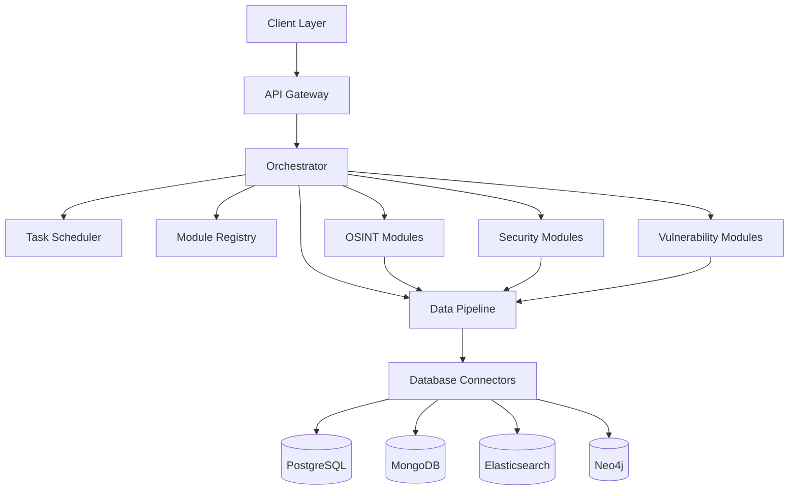

<div align="center">

# 🛡️ SKrulll

### Advanced Cybersecurity and OSINT Tool Orchestrator

[](https://opensource.org/licenses/MIT)
[](https://www.python.org/downloads/)
[](https://www.docker.com/)
[](CONTRIBUTING.md)

<svg width="200" height="200" viewBox="0 0 100 100" xmlns="http://www.w3.org/2000/svg">
  <title>SKrulll Logo</title>
  <defs>
    <linearGradient id="grad1" x1="0%" y1="0%" x2="100%" y2="100%">
      <stop offset="0%" style="stop-color:#007bff;stop-opacity:1" />
      <stop offset="100%" style="stop-color:#00bfff;stop-opacity:1" />
    </linearGradient>
    <linearGradient id="grad2" x1="0%" y1="0%" x2="100%" y2="100%">
      <stop offset="0%" style="stop-color:#28a745;stop-opacity:1" />
      <stop offset="100%" style="stop-color:#20c997;stop-opacity:1" />
    </linearGradient>
  </defs>

  <!-- Core 'S' like structure with Orchestration hints -->
  <g transform="translate(50 50) scale(0.8)">
    <!-- Main 'S' like shape - Blue Gradient -->
    <path d="M 20 -30
             Q 0 -30 -15 -15
             Q -30 0 -15 15
             Q 0 30 20 30
             L 25 30
             Q 5 30 -10 15
             Q -25 0 -10 -15
             Q 5 -30 25 -30
             Z" 
          fill="url(#grad1)" stroke="#0056b3" stroke-width="2"/>

    <!-- Connecting/Orchestrating elements - Greenish Gradient -->
    <circle cx="-15" cy="-15" r="5" fill="url(#grad2)" stroke="#198754" stroke-width="1"/>
    <circle cx="20" cy="30" r="5" fill="url(#grad2)" stroke="#198754" stroke-width="1"/>
    <circle cx="20" cy="-30" r="4" fill="url(#grad2)" stroke="#198754" stroke-width="1"/>
    
    <!-- Lines suggesting connection/flow -->
    <line x1="-15" y1="-15" x2="0" y2="0" stroke="#007bff" stroke-width="1.5"/>
    <line x1="20" y1="30" x2="0" y2="0" stroke="#007bff" stroke-width="1.5"/>
    <line x1="20" y1="-30" x2="0" y2="0" stroke="#007bff" stroke-width="1.5"/>

    <!-- Central OSINT 'eye' / Focus Point (Subtle) -->
    <circle cx="0" cy="0" r="8" fill="none" stroke="white" stroke-width="1.5"/>
    <circle cx="0" cy="0" r="3" fill="white"/>
  </g>
</svg>

*Unify, Orchestrate, Secure*

</div>

## 📋 Table of Contents

- [Overview](#-overview)
- [Key Features](#-key-features)
- [System Architecture](#-system-architecture)
- [Components](#-components)
- [Installation](#-installation)
  - [Prerequisites](#prerequisites)
  - [Standard Installation](#standard-installation)
  - [Docker Installation](#docker-installation)
- [Usage Guide](#-usage-guide)
  - [Command Line Interface](#command-line-interface)
  - [Web Interface](#web-interface)
  - [API Integration](#api-integration)
- [Use Cases](#-use-cases)
- [Development](#-development)
  - [Adding New Modules](#adding-new-modules)
  - [Testing](#testing)
- [Roadmap](#-roadmap)
- [Contributing](#-contributing)
- [License](#-license)
- [Acknowledgments](#-acknowledgments)
- [Contact & Support](#-contact--support)

## 🔍 Overview

**SKrulll** is a comprehensive cybersecurity and OSINT (Open Source Intelligence) tool orchestrator that provides a unified interface for various security tools. It enables seamless integration between different security components with centralized configuration and data sharing capabilities.

SKrulll bridges the gap between disparate security tools, creating a cohesive ecosystem where data flows efficiently between reconnaissance, scanning, analysis, and reporting phases. This integration dramatically improves security assessment workflows and provides deeper insights through cross-tool data correlation.

> *"SKrulll transforms the fragmented security tooling landscape into a unified security intelligence platform."*

## 🚀 Key Features

- **🧩 Modular Architecture**: Easily extend functionality with new tools and capabilities
- **🖥️ Unified Interface**: Access all tools through a consistent CLI and intuitive web dashboard
- **⚙️ Automated Workflows**: Chain tools together for comprehensive security assessments
- **📊 Advanced Reporting**: Generate consolidated findings from multiple tools with customizable templates
- **🗄️ Multi-Database Support**: Store and query data using PostgreSQL, MongoDB, Elasticsearch, and Neo4j
- **📈 Interactive Visualization**: Generate dynamic visual representations of network maps, attack paths, and data relationships
- **⏱️ Intelligent Scheduling**: Automate recurring tasks with dependency awareness and priority handling
- **🔄 Real-time Monitoring**: Track ongoing scans and receive alerts on critical findings
- **🔌 API Integration**: Connect with external systems through a comprehensive REST API
- **🔒 Role-based Access Control**: Secure multi-user environment with granular permissions

## 🏗️ System Architecture

SKrulll follows a microservices architecture with containerized components that can scale independently:



This architecture ensures:
- **Scalability**: Components can be scaled independently based on workload
- **Resilience**: Failure in one module doesn't affect the entire system
- **Flexibility**: New modules can be added without disrupting existing functionality
- **Performance**: Resource-intensive tasks can be distributed across multiple nodes

## 🧰 Components

SKrulll consists of several key components working together:

| Component | Description | Technologies |
|-----------|-------------|--------------|
| **OSINT Modules** | Domain reconnaissance, social media analysis, search footprinting | Python, Go |
| **Security Modules** | Vulnerability scanning, port scanning, network mapping, attack vector analysis | Python, Rust |
| **Orchestrator** | Core system that manages tool execution and data flow | Python |
| **Web Interface** | User-friendly dashboard for managing scans and viewing results | Flask, React |
| **CLI** | Command-line interface for scripting and automation | Python, Click |
| **Scheduler** | Task scheduling and management with dependencies | Python, Celery |
| **Database Connectors** | Interfaces to various databases for data storage and retrieval | SQLAlchemy, PyMongo, Elasticsearch-DSL, Neo4j-Python |

## 📥 Installation

### Prerequisites

- Python 3.8+
- Docker and Docker Compose (for containerized components)
- Neo4j (for attack path mapping)
- PostgreSQL (for primary data storage)
- MongoDB (for unstructured data storage)
- Elasticsearch (for search and analytics)

### Standard Installation

1. **Clone the repository**:
   ```bash
   git clone https://github.com/pixelbrow720/SKrulll.git
   cd SKrulll
   ```

2. **Create a virtual environment** (recommended):
   ```bash
   python -m venv venv
   source venv/bin/activate  # On Windows: venv\Scripts\activate
   ```

3. **Install Python dependencies**:
   ```bash
   pip install -r requirements.txt
   ```

4. **Set up the configuration**:
   ```bash
   cp config/config.example.yaml config/config.yaml
   # Edit config.yaml with your settings
   ```

5. **Initialize the databases**:
   ```bash
   python main.py db init
   ```

6. **Run the application**:
   ```bash
   python main.py
   ```

### Docker Installation

For a fully containerized setup:

1. **Configure environment variables**:
   ```bash
   cp .env.example .env
   # Edit .env with your settings
   ```

2. **Start the services**:
   ```bash
   docker-compose -f templates/docker-compose.yml up -d
   ```

This will start all required services including the SKrulll application, databases, and supporting services.

## 📚 Usage Guide

### Command Line Interface

SKrulll provides a comprehensive CLI for all operations:

```bash
# Get help and list all commands
python main.py --help

# Run a port scan with service detection
python main.py security portscan 192.168.1.1 --ports 1-1000 --service-detection

# Perform comprehensive domain reconnaissance
python main.py osint domain example.com --whois --dns --subdomains --technologies --screenshots

# Analyze social media presence across platforms
python main.py osint social username --platforms twitter,reddit,linkedin,instagram --sentiment-analysis

# Run a vulnerability scan with custom templates
python main.py security vulnscan https://example.com --level high --templates web,api,cms

# Map network topology and identify potential attack paths
python main.py security netmap 192.168.1.0/24 --visualize --attack-paths

# Schedule a recurring task with notification
python main.py schedule add "Daily Security Scan" "security vulnscan example.com" --cron "0 0 * * *" --notify email@example.com

# Generate a comprehensive security report
python main.py report generate --modules osint,security,vulnerability --format pdf,html --output report.pdf
```

### Web Interface

The web interface provides a user-friendly dashboard for managing scans and viewing results:

1. **Start the web interface**:
   ```bash
   python main.py webui
   ```

2. **Access the dashboard**:
   - Open your browser and navigate to `http://localhost:5000`
   - Log in with your credentials

3. **Key features**:
   - Interactive dashboard with real-time scan status
   - Drag-and-drop workflow builder
   - Customizable reporting templates
   - Interactive network and attack path visualizations
   - User and role management
   - System configuration and module management

### API Integration

SKrulll provides a RESTful API for integration with other systems:

```bash
# Start the API server
python main.py api

# API is available at http://localhost:8000/api/v1
```

Example API usage with curl:

```bash
# Authenticate and get token
curl -X POST http://localhost:8000/api/v1/auth/token \
  -H "Content-Type: application/json" \
  -d '{"username": "admin", "password": "password"}'

# Start a port scan
curl -X POST http://localhost:8000/api/v1/security/portscan \
  -H "Authorization: Bearer YOUR_TOKEN" \
  -H "Content-Type: application/json" \
  -d '{"target": "192.168.1.1", "ports": "1-1000", "options": {"service_detection": true}}'
```

## 🔮 Use Cases

SKrulll excels in various security scenarios:

### 1. Comprehensive Security Assessment

Combine OSINT, vulnerability scanning, and network mapping to perform a full security assessment:

```bash
# Create and run a comprehensive assessment workflow
python main.py workflow run comprehensive-assessment target.com
```

### 2. Continuous Security Monitoring

Set up recurring scans to monitor for new vulnerabilities or changes:

```bash
# Schedule daily security checks
python main.py schedule add "Daily Security Check" "workflow run security-monitoring target.com" --cron "0 0 * * *"
```

### 3. Attack Surface Mapping

Identify and visualize all potential entry points to your systems:

```bash
# Generate an attack surface map
python main.py security attack-surface-map target.com --include-cloud --include-third-party
```

### 4. Threat Intelligence Integration

Correlate findings with threat intelligence data:

```bash
# Enrich scan results with threat intelligence
python main.py enrich scan-results-20250510 --threat-intel
```

## 💻 Development

### Adding New Modules

1. **Create a new module** in the appropriate directory:
   ```bash
   python main.py dev create-module security my-new-scanner
   ```

2. **Implement the required interfaces** in the generated template files

3. **Register the module** with the orchestrator:
   ```python
   # In your module's __init__.py
   from orchestrator import register_module

   register_module('my-new-scanner', MyNewScannerModule)
   ```

4. **Add CLI commands** in the module's cli.py file

See the [Developer Guide](docs/development.md) for detailed instructions and best practices.

### Testing

SKrulll includes comprehensive testing capabilities:

```bash
# Run all tests
python -m unittest discover tests

# Run specific test categories
python -m unittest tests.test_integration
python -m unittest tests.test_e2e

# Run with coverage report
python -m coverage run -m unittest discover
python -m coverage report
python -m coverage html  # Generates detailed HTML report

# Run benchmarks
python tests/benchmark.py
```

## 📅 Roadmap

SKrulll is under active development with the following features planned:

- **Cloud Integration**: Native support for AWS, Azure, and GCP security assessment
- **Machine Learning**: Anomaly detection and predictive security analytics
- **Expanded OSINT**: Additional data sources and correlation techniques
- **Mobile Security**: Assessment tools for Android and iOS applications
- **Supply Chain Security**: Dependency analysis and vulnerability tracking
- **Deception Technology**: Honeypot deployment and monitoring
- **Compliance Reporting**: Automated compliance assessment for various standards
- **Threat Hunting**: Advanced tools for proactive threat detection

## 👥 Contributing

Contributions are welcome! Here's how you can help:

1. **Fork the repository**
2. **Create a feature branch**: `git checkout -b feature/amazing-feature`
3. **Commit your changes**: `git commit -m 'Add some amazing feature'`
4. **Push to the branch**: `git push origin feature/amazing-feature`
5. **Open a Pull Request**

Please read our [Contributing Guidelines](CONTRIBUTING.md) for details on our code of conduct and development process.

## 📄 License

This project is licensed under the MIT License - see the [LICENSE](LICENSE) file for details.

## 🙏 Acknowledgments

- Thanks to all the open-source security tools that SKrulll builds upon
- Special thanks to our contributors and community members
- Inspired by the need for better integration between security tools

## 📞 Contact & Support

- **GitHub**: [@pixelbrow720](https://github.com/pixelbrow720)
- **Twitter**: [@BrowPixel](https://twitter.com/BrowPixel)
- **Email**: [pixelbrow13@gmail.com](mailto:pixelbrow13@gmail.com)
- **Website**: [skrulll.security](https://skrulll.security)
- **Documentation**: [docs.skrulll.security](https://docs.skrulll.security)
- **Community Forum**: [community.skrulll.security](https://community.skrulll.security)

---

<div align="center">
<p>Made with ❤️ by the SKrulll Team</p>
<p>© 2025 SKrulll Security - All Rights Reserved</p>
</div>
